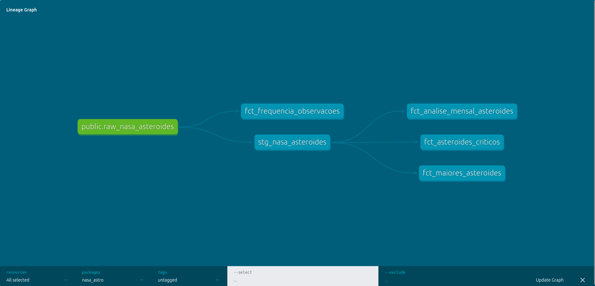

# ☄️ NASA Asteroids Data Pipeline

<p align="center">
  
  
  
  
  
</p>

<p align="center">
  Pipeline de dados end-to-end para ingestão, transformação e governança de dados de asteroides monitorados pela NASA (Near Earth Object Web Service API), aplicando boas práticas de Engenharia de Dados desde a camada bruta até a modelagem dimensional.
</p>

---

## 📋 Índice

- [Sobre o Projeto](#-sobre-o-projeto)
- [Arquitetura e Tecnologias](#️-arquitetura-e-tecnologias)
- [Linhagem de Dados](#-linhagem-de-dados-lineage-dag)
- [Governança e Qualidade de Dados](#-governança-e-qualidade-de-dados-data-quality)
- [Como Executar](#-como-executar)
- [Estrutura do Repositório](#-estrutura-do-repositório)
- [Roadmap](#-roadmap)
- [Autor](#-autor)

---

## 🚀 Sobre o Projeto

Este projeto implementa um pipeline de dados robusto, escalável e orquestrado para a ingestão, transformação e governança de dados operacionais sobre asteroides monitorados pela NASA. O foco principal é aplicar boas práticas de **Engenharia de Dados**, garantindo integridade, testes e documentação das tabelas desde a camada de dados brutos (raw) até a modelagem dimensional final (marts).

## 🛠️ Arquitetura e Tecnologias

O fluxo do pipeline segue a arquitetura de um Data Warehouse local moderno, estruturado em containers:

| Etapa | Tecnologia | Descrição |
|---|---|---|
| **Orquestração** | Apache Airflow (Astronomer / Astro CLI) | Gerencia as tasks de extração incremental da API e carga no banco de dados via TaskFlow API |
| **Ingestão e Carga (EL)** | Python + Airflow Hooks | Scripts otimizados integrados aos hooks do Airflow (`PostgresHook`) para persistência |
| **Armazenamento** | PostgreSQL (Docker) | Banco de dados relacional rodando em ambiente isolado |
| **Transformação (T)** | dbt (Data Build Tool) | Modulariza as queries em camadas (Staging e Marts) |
| **Data Quality** | Testes dbt | Validação automatizada de chaves, nulos e regras de negócio |

## 📐 Linhagem de Dados (Lineage DAG)

O pipeline segue o conceito de separação de responsabilidades em camadas dentro do Data Warehouse:

```
raw_nasa_asteroides  →  stg_nasa_asteroides  →  marts/
```

1. **`source.public.raw_nasa_asteroides`** — camada onde o dado pousa em seu estado bruto, exatamente como retornado pela API da NASA.
2. **`stg_nasa_asteroides`** — camada de staging responsável pela limpeza inicial, padronização de tipos de dados e renomeação de campos.
3. **`marts`** — tabelas fato prontas para consumo analítico:
   - `fct_analise_mensal_asteroides`
   - `fct_asteroides_criticos`
   - `fct_frequencia_observacoes`
   - `fct_maiores_asteroides`

📸 *Print da DAG de linhagem gerada pelo `dbt docs` (porta 8001):*



## 🧪 Governança e Qualidade de Dados (Data Quality)

Para blindar o repositório contra dados corrompidos ou inconsistências vindas da API, foram implementados **13 testes de dados automatizados** gerenciados pelo dbt, garantindo que regras críticas de negócio nunca sejam quebradas:

- **Testes de Unicidade (`unique`)** — aplicados nas chaves primárias das tabelas fato (ex.: `asteroide_nome` agrupado) para mitigar duplicações.
- **Testes de Não-Nulidade (`not_null`)** — aplicados em métricas severas e campos de identificação essenciais da NASA.

Para rodar os testes localmente:

```bash
dbt test
```

## ▶️ Como Executar

```bash
# 1. Clone o repositório
git clone https://github.com/RicarteAnalyst/<nasa-asteroids-pipeline>.git
cd <nasa-asteroids-pipeline>

# 2. Suba o ambiente Airflow (Astro CLI)
astro dev start

# 3. Configure as variáveis de ambiente (.env)
cp .env.example .env

# 4. Rode o pipeline no Airflow UI (localhost:8080)

# 5. Rode as transformações e os testes com dbt
dbt run
dbt test

# 6. Suba a documentação de linhagem
dbt docs generate
dbt docs serve --port 8001
```

> ⚠️ *Ajuste este bloco com os comandos reais do seu projeto (variáveis de ambiente necessárias, portas, pré-requisitos como Docker/Astro CLI instalados, etc.).*

## 📁 Estrutura do Repositório

```
.
├── dags/                  # DAGs do Airflow (TaskFlow API)
├── dbt_project/
│   ├── models/
│   │   ├── staging/       # stg_nasa_asteroides
│   │   └── marts/         # fct_*
│   └── tests/              # testes customizados (se houver)
├── docs/
│   └── images/             # prints (lineage DAG, dashboards, etc.)
├── .env.example
├── requirements.txt
└── README.md
```

## 🗺️ Roadmap

- [ ] Adicionar camada de visualização (Power BI / Looker Studio)
- [ ] Deploy em ambiente cloud (ex.: Databricks / BigQuery)
- [ ] CI/CD para testes automatizados do dbt

## 👤 Autor

**Nicollas Ricarte**
Data Science Student | Data Engineering & Analytics Portfolio
🔗 [GitHub — RicarteAnalyst](https://github.com/RicarteAnalyst)
